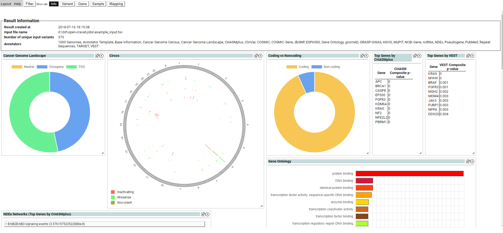
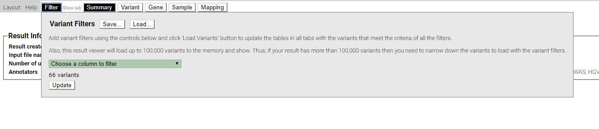
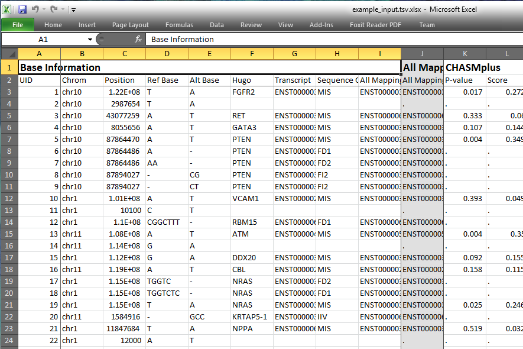
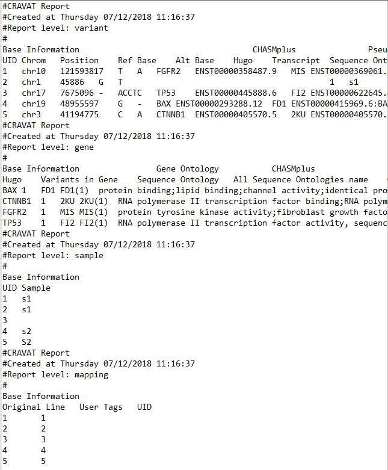

===============
Viewing results
===============

At the end of a run, CRAVAT can generate multiple types of reports in
both human and machine readable formats. These reports contain the
variant and gene data generated by the annotators that were run in this
CRAVAT job. By default either an excel or text report is generated at
the end of the run . The type of default report generated can be changed
using the ``reporter`` key in the ``cravat.yml`` file in the modules
directory. CRAVAT comes with an interactive web viewer, which can be
launched at any time using the ``oc gui`` command.

Multiple reports can be generated in a run by using the ``-t`` flag.

.. code:: shell

    oc run input.vcf -t text excel

This command will launch a web server and a browser tab with
Open-CRAVAT's web result viewer. To end the web server on your terminal,
press Ctrl-C or Ctrl-Break. To know how you can press Ctrl-Break, see
`here <https://en.wikipedia.org/wiki/Break_key#Keyboards_without_Break_key>`__.

Each job also generates a SQLite database which stores the complete
record of all data generated during the run. This SQLite database is
placed in the same directory as the input file and is named
``{input_file_name}.sqlite``. the name and location will be different if
CRAVAT was run with the ``-n`` or ``-d`` flags. This SQLite database can
be queried by advanced users if desired.

Interactive Viewer
==================

The interactive viewer is used to explore the CRAVAT results using
filters, tables, and visualizations. It is launched by passing a job
result database to ``oc gui``.

.. code:: shell

    oc gui job.sqlite

By default the database is placed in the same directory as the input
file, and is named by appending ``.sqlite`` to the end of the input file
name. This will change if OpenCRAVAT is run with the ``-n`` or ``-d``
flags.

The above command will start a local python server and open a webpage
using your default browser. The webpage is the interactive viewer. It is
organized by tabs, shown at the top of the screen. The tabs are similar
to the excel report sheets and text report sections.

Summary Tab
-----------

   summary widgets

The Summary tab shows overall information about the job, and can be used
to create, save, and load filters.

Summary Widgets
~~~~~~~~~~~~~~~

The Summary tab may also contain graphical summary widgets, which
provide a high level overview of the job. Only the summary widgets
installed are displayed. CRAVAT includes some widgets by default, and
more can be found in the CRAVAT store. Some widgets depend on specific
annotators. Widgets on the Summary tab can be resized, hidden and
rearranged similarly to the widgets in the variant tab, which is
explained below.

Filters
=======

   filter dropdown

OpenCRAVAT filters can be applied to any annotation and affect the
results displayed across the entire viewer. When the filter is changed,
the data passed to every other tab, table, or widget is **only** the
data which passes the filter.

To add filters, select the filter menu from the top bar. Individual
filters are created using the drop-down menu in the Variant Filters box.
As filters are created and adjusted, the number of variants passing the
filter is shown below. When the update button is pressed, the viewer
loads the variants and genes which passed the filters.

Filters can also be saved so that they are available across viewer
sessions. Click the save button near the top of the filter menu to give
a filter set a name, and save it to the sqlite database. Then the filter
can be reloaded by clicking the load button, and entering the name of
the saved filter. Multiple filter sets may be saved and loaded.

Variant Tab
===========

   variant tab

The Variant tab is one of the main data display tabs in CRAVAT. It is
divided into two sections, a data table, and a collection of
visualization widgets.

For each variant, we select a representative transcript isoform, which
represents the most severe mutation consequence, according to the order
of: frameshift insertion, frameshift deletion, stop gain, splice site,
stop loss, inframe insertion, inframe deletion, complex substitution,
missense, synonymous, unknown, intron, 5' UTR, 3' UTR, 2kb upstream, and
2kb downstream. Splice variants are defined as variants within two base
pairs of an exon-exon junction.

Data table
----------

The data table shows all of the annotations available, grouped by
annotator. Columns may be resized, and moved individually or as a group.
Move columns/groups by clicking and dragging their header. Columns can
also be removed or added to the table using the layout drop-down menu in
the top left of the page.

   viewer columns manipulation

Visualization Widgets
---------------------

The visualization widgets section displays a visual summary of the
current row in the data table. It is designed so that the user can
quickly move through the data table and understand the contents of a row
at a glance.

Widgets can be manipulated in different ways. They can be resized and
moved using the mouse. Widgets can be hidden by either clicking on the x
button, or by using the layout menu in the top left. Hidden widgets can
also be displayed again using the layout menu. Layouts can be saved and
loaded to preserve certain views, or to create a check-point before
making major layout changes.

.. figure:: figures/viewer-variants-widgets.gif
   :alt: viewer variant widgets

   viewer variant widgets

Saving a layout will save the columns displayed, column order, widgets
displayed, widget size, and widget order. Like filters, saved layouts
are available across viewer sessions.

Gene Tab
========

The Gene tab is identical to the variant tab, but displays gene level
information.

Sample Tab
==========

The Sample tab shows which sample(s) contained a variant. It is
currently a work in progress.

Mapping Tab
===========

The Mapping tab shows which input lines in the original file mapped to
which variants, and which user-supplied tags were included with that
line. It is currently a work in progress.

Excel Report
============

By default, the excel report is called {input\_file\_name}.xlsx. The
name will be different if CRAVAT was run with the ``-n`` or ``-d``
flags. It consists of multiple pages, explained below.

Info
----

A title sheet including information about the run

Variant
-------

Variant level information. Each variant has a row, and columns are
grouped together by annotator.

   excel report

Gene
----

Gene level information. Formatted like the variant tab.

Sample
------

Variant ids and the samples they occur in.

Mapping
-------

A Mapping or original input lines to the variant ids and user supplied
tags they contain.

Text Report
===========

The text report is a tab separated file consisting of multiple sections.
The sections match those in the excel report. By default, the text
report is called {input\_file\_name}.tsv. The name will be different if
CRAVAT was run with the ``-n`` or ``-d`` flags.

   text report
