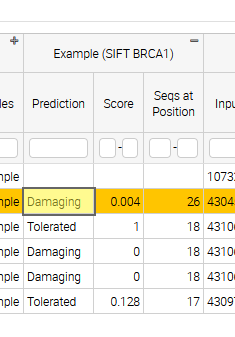

==================
Annotator tutorial
==================

Writing an Annotator
====================

Method developers and researchers can make their results available by
packaging them as an OpenCRAVAT annotator and then publishing them to
the OpenCRAVAT Store. Annotators typically include a database of
annotations for fast high-throughput analysis of large variant files.
The preferred storage mechanism for annotator reference data is sqlite
databases, but other formats can be used.

This page provides a tutorial for writing an annotator from start to
finish. For detailed documentation on each component of an annotator,
try :doc:`Annotator Reference <./Annotator-Reference>`

The completed annotator from this tutorial can be seen at the
`OpenCRAVAT Modules
repository <https://github.com/KarchinLab/open-cravat-modules-karchinlab/tree/master/annotators/example>`__,
which also contains the code for most other annotators.

.. youtube:: 8yUVmp8GCEU

.. mermaid::

  flowchart TD
    A[Initialize Module] --> B
    click A "#initializing-an-annotator-module"
    B[Load Annotation\ninto Database] --> C
    click B "#loading-annotations-as-a-sqlite-file"
    C[Map Annotations\nin Python] -->  D
    click C "#mapping-our-annotator-file"
    D[Customize Output/\nDisplay] 

Creating an annotator module requires the following:

1. Initializing an new annotator skeleton using
   ``oc new annotator <modulename>``
2. Loading an annotator file into a SQLite database
   (``<modulename>.sqlite``\ ss) using ``sqlite3``
3. Mapping the annotator sqlite file in the ``<modulename>.py`` file
4. Customizing the output using the ``<modulename>.yml`` file

Annotator Module Structure
--------------------------

Before we initialize a new module, let's look at the basic structure of an annotator module.

There are three files we need to concentrate on to get our annotator working: ``data/sift.sqlite``, ``sift.py``, and ``sift.yml``. 

::

   /Users/Shared/open-cravat/modules/annotators/sift
   ├── data
   │.. └── sift.sqlite               ## contains annotations in sqlite format
   ├── sift.md                       ## describes how to use annotator
   ├── sift.py                       ## maps annotation columns to variant input
   └── sift.yml                      ## configures output columns

   3 directories, 5 files

Initializing an annotator module
================================

Before we create a new annotator, we need to find where modules are
installed on the system. We can do this by using ``oc config md``:

.. code:: 

   oc config md

::

   /Users/Shared/open-cravat/modules

Now we can create our new ``sift`` module using ``oc new annotator``:

.. code:: 

   oc new annotator sift

::

   Annotator sift_annotator created at /Users/Shared/open-cravat/modules/annotators/sift

If we take a look at the file structure of our initialized module it
looks like this:

.. code:: 

   tree  /Users/Shared/open-cravat/modules/annotators/sift/

::

   /Users/Shared/open-cravat/modules/annotators/sift/
   ├── data
   │   └── sift.sqlite
   ├── sift.md
   ├── sift.py
   └── sift.yml

So now we need to get our annotations into the ``sqlite`` format, map it
in our ``annotate()`` method, and then customize the display in our
``.yml`` file.

.. note::
    Developers can change the modules directory by passing the new directory
    as an argument to ``oc config md``. The command changes the directory
    that OpenCRAVAT searches for modules. The command does not move
    currently installed modules to the new directory, which must be done
    manually if desired.

.. code:: bash

    $ oc config md /my/custom/modules/location
    /my/custom/modules/location
    $ oc config md
    /my/custom/modules/location


Loading annotations as a SQLite file
====================================

OpenCravat requires us to supply our annotations as a SQLite file.
``sqlite3`` is a database system that allows us to package our
annotations in the ``.sqlite`` format, which makes our annotations
accessible to OpenCravat.

SQLite is available on most systems (MacOS/PC/Linux) as the ``sqlite3``
command.

Fetching our SQLite annotations
-------------------------------

.. youtube:: Yca9tfw6kEY

Let’s take a look at an example ``.sqlite`` file before we load our own.
In our annotator’s ``data/`` directory (for example,
``/Users/Shared/open-cravat/modules/annotators/sift/data/``), we can
fetch an example ``.sqlite`` file. We’ll rename it ``sift.sqlite``.

.. code:: bash

   wget "https://github.com/KarchinLab/open-cravat-modules-karchinlab/blob/master/annotators/example/data/example.sqlite?raw=true" -O sift.sqlite

::

   --2024-05-24 07:31:22--  https://github.com/KarchinLab/open-cravat-modules-karchinlab/blob/master/annotators/example/data/example.sqlite
   Resolving github.com (github.com)... 140.82.113.4
   Connecting to github.com (github.com)|140.82.113.4|:443... connected.
   HTTP request sent, awaiting response... 200 OK
   Length: unspecified [text/html]
   Saving to: ‘example.sqlite’

   example.sqlite                      [  <=>                                                ] 157.51K   602KB/s    in 0.3s    

   2024-05-24 07:31:23 (602 KB/s) - ‘example.sqlite’ saved [161288]

Now that we have it in our annotator’s ``data/`` directory, we can query
it.

.. code:: bash

   sqlite3 sift.sqlite 'select * from sift limit 10;'

::

   chr17|43045681|G|A|1.0|7
   chr17|43045681|G|G|1.0|7
   chr17|43045682|T|A|0.0|7
   chr17|43045682|T|C|0.0|7
   chr17|43045682|T|G|0.0|7
   chr17|43045682|T|T|1.0|7
   chr17|43045683|A|A|1.0|7
   chr17|43045683|A|C|0.0|7
   chr17|43045683|A|G|0.0|7
   chr17|43045683|A|T|0.0|7

Importing a Comma Separated Value file to SQLite
------------------------------------------------

.. youtube:: 5n-bQsuqe0o

Now that we’re more familiar with the SQLite format, we can start
loading our own version. We’ll do this for a CSV (comma separated value)
file first.

We’ll first create the ``sift.sqlite`` file by using ``sqlite3``. This
will put us into the ``sqlite3`` prompt interface.

.. code:: sql

   sqlite3 sift.sqlite

::

   SQLite version 3.43.2 2023-10-10 13:08:14
   Enter ".help" for usage hints.
   sqlite>

.. container::

      **Interacting with the ``sqlite3`` prompt**

      There are two main ways we can interact with the ``sqlite3``
      interface: **SQL Queries**:

      ::

         SELECT * from SIFT LIMIT 5;

      Note that SQL queries always end with a ``;``.

      The other way we can interact with the interface are **dot
      commands**, such as ``.mode`` or ``.schema`` - these do not end
      with a ``;``. These dot commands are are often used to change
      internal settings for the sqlite database. For example, to set the
      import format to ``.csv``, we can use:

      ::

         .mode csv

      Again, note that these commands **don’t** end with a ``;``. You
      will get errors if you terminate them with ``;``.

      To make things easier to distinguish, we’ll use all caps for SQL
      and lowercase for dot commands.

Creating our Table
------------------

Before we load our data in, we need to create our table. This is
important because our columns have different data types, and we have to
map them to the `SQLite data
types <https://www.sqlite.org/draft/datatype3.html>`__:

.. code:: sql

   CREATE TABLE "sift" ('chrom' TEXT, 'pos' INT, 
                        'ref' TEXT, 'alt' TEXT, 
                        'score' REAL, 'nseq' INT);
   CREATE INDEX main_index on sift (chrom, pos, ref, alt);

Note that ``score`` (the SIFT score) has a ``REAL`` data type.

Now that the table is created, we can load our ``sift.csv`` file. We
need to change the mode to ``csv``.

.. code:: sql

   .mode csv

Now we can import our data using the ``.import`` dot command. Because
our ``sift.csv`` has a header row, we need to skip it, so we use the
``--skip 1`` argument.

.. code:: sql

   .import --skip 1 sift.csv sift

We can check that we loaded in our data correctly by using the
``.schema`` command and a ``SELECT *`` query:

.. code:: sql

   .schema

::

   CREATE TABLE sift (chrom text, pos int, ref text, alt text, score real, nseq int);
   CREATE INDEX main_index on sift (chrom, pos, ref, alt);

cha

.. code:: sql

   .mode box
   SELECT * FROM sift LIMIT 5;

::

   ┌───────┬──────────┬─────┬─────┬───────┬──────┐
   │ chrom │   pos    │ ref │ alt │ score │ nseq │
   ├───────┼──────────┼─────┼─────┼───────┼──────┤
   │ chr17 │ 43045681 │ G   │ A   │ 1.0   │ 7    │
   │ chr17 │ 43045681 │ G   │ G   │ 1.0   │ 7    │
   │ chr17 │ 43045682 │ T   │ A   │ 0.0   │ 7    │
   │ chr17 │ 43045682 │ T   │ C   │ 0.0   │ 7    │
   │ chr17 │ 43045682 │ T   │ G   │ 0.0   │ 7    │
   └───────┴──────────┴─────┴─────┴───────┴──────┘

When we’re done, we can use ``.exit`` to exit our session and save our
``.sqlite`` file.

.. code:: sql

   .exit

We can double check our ``.sqlite`` file has our information by using
``sqlite3`` to execute a query on the command line:

.. code:: sql

   sqlite3 sift.sqlite 'select * from sift limit 5;'


.. note::

    **Loading VCF Files as Annotations**
    
    .. youtube:: 5n-bQsuqe0o?si=bkBgPpc_1pLCnOJp&t=267

    Let’s try loading in an RNA Editing VCF file into a ``.sqlite``
    file.

    The first thing that we should notice is that there are multiple
    rows we need to skip to load our VCF data in. There are 4 lines of
    metadata + 1 header row that we need to skip to load our data in
    correctly.

    .. code:: bash

      tedladeras$ head GRCh38.RNAediting.vcf 

    ::

      ##fileformat=VCFv4.2
      ##reference=GRCh38
      ##source=Rediportal
      ##INFO=<ID=RNAEDIT,Type=String,Description="A known or predicted RNA-editing site">
      #CHROM  POS     ID      REF     ALT     QUAL    FILTER  INFO
      chr1    10187   .       A       G       .       .       RNAEDIT=RADAR
      chr1    10193   .       A       G       .       .       RNAEDIT=RADAR
      chr1    10211   .       A       G       .       .       RNAEDIT=RADAR
      chr1    10217   .       A       G       .       .       RNAEDIT=RADAR
      chr1    10223   .       A       G       .       .       RNAEDIT=RADAR

    Again, we create our database:

    ::

      sqlite3 vcf.sqlite

    Then we can define our table:

    .. code:: sql

       create table "vcf" ("chrom" TEXT, "pos" INT, "id" TEXT, 
                           "ref" TEXT, "alt" TEXT, "qual" INT, 
                           "filter" TEXT, "info" TEXT);

    And then we can load our VCF file. Note that we need to skip 5
    rows (VCF file metadata and the header row) to load our data in.

    .. code:: sql

      .mode tabs
      .import --skip 5 GRCh38.RNAediting.vcf vcf

    Then we can check that we loaded the data correctly:

    .. code:: sql

      .mode box
      select * from vcf limit 10;

    Finally, now that we’re satisfied, we can ``.exit``:

    .. code:: sql

      .exit


Mapping our annotator file
==========================

.. youtube:: https://youtu.be/lc9BgajE2xw

Now that our data is loaded into our ``.sqlite`` file, we need to set up
our mapping. If we look in ``sift.py``, we’ll see there are stubs for
three methods: ``setup()``, ``annotate()``, and ``cleanup()``:

.. mermaid::

  flowchart LR
    A[sift_annotator.py] --method-->B["setup()"]
    A --method-->C["annotate()"]
    A --method-->D["cleanup()"]

This is what the ``.py`` file looks like:

.. code:: bash

   cat /Users/Shared/open-cravat/modules/annotators/sift/sift.py

::

   import sys
   from cravat import BaseAnnotator
   from cravat import InvalidData
   import sqlite3
   import os

   class CravatAnnotator(BaseAnnotator):

       def setup(self): 
           """
           Set up data sources. 
           Cravat will automatically make a connection to 
           data/example_annotator.sqlite using the sqlite3 python module. The 
           sqlite3.Connection object is stored as self.dbconn, and the 
           sqlite3.Cursor object is stored as self.cursor.
           """
           pass
       
       def annotate(self, input_data, secondary_data=None):
           """
           The annotator parent class will call annotate for each line of the 
           input file. It takes one positional argument, input_data, and one
           keyword argument, secondary_data.
           
           input_data is a dictionary containing the data from the current input 
           line. The keys depend on what what file is used as the input, which can 
           be changed in the module_name.yml file. 
           Variant level includes the following keys: 
               ('uid', 'chrom', 'pos', 'ref_base', 'alt_base')
           Variant level crx files expand the key set to include:
               ('hugo', 'transcript','so','all_mappings')
           Gene level files include
               ('hugo', 'num_variants', 'so', 'all_so')
           
           secondary_data is used to allow an annotator to access the output of
           other annotators. It is described in more detail in the CRAVAT 
           documentation.
           
           annotate should return a dictionary with keys matching the column names
           defined in example_annotator.yml. Extra column names will be ignored, 
           and absent column names will be filled with None. Check your output
           carefully to ensure that your data is ending up where you intend.
           """
           out = {}
           out['placeholder_annotation'] = 'placeholder value'
           return out
       
       def cleanup(self):
           """
           cleanup is called after every input line has been processed. Use it to
           close database connections and file handlers. Automatically opened
           database connections are also automatically closed.
           """
           pass
           
   if __name__ == '__main__':
       annotator = CravatAnnotator(sys.argv)
       annotator.run()

We will focus on the ``annotate()`` method first.

``annotate()`` method
---------------------

Our ``annotate()`` method is where we map our annotations in our
``.sqlite`` file to an input called ``input_data``. ``input_data``
essentially is a single row of our genomic file to annotate represented
as a dictionary.

This is what our ``input_data`` list looks like:

.. container:: cell

   .. container:: cell-output-display

      .. container::

         .. container::

            |image4|

In order to annotate our file, we need to map each relevant element of
``input_data`` to a column in our ``.sqlite`` file.

.. container:: columns

   .. container:: column

      .. figure:: images/mapping.jpg
         :alt: Mapping between ``input_data`` and our ``sift`` table

         Mapping between ``input_data`` and our ``sift`` table

   .. container:: column

      .. code:: python

         chrom = input_data["chrom"]
         pos = input_data["pos"]
         query = (f'select score, nseq from sift' \
                   'where chrom="{chrom}"'\
                   'and pos="{pos}"')
         self.cursor.execute(query)
         result = self.cursor.fetchone()

The first thing we do is we extract ``chrom`` and ``pos`` from our list:

.. code:: python

   chrom = input_data["chrom"]
   pos = input_data["pos"]

Let’s look at our query next.

.. code:: python

   query = (f'select score, nseq from sift' \
             'where chrom="{chrom}"'\
             'and pos="{pos}"')

Note that we are querying our table, so the table’s column is on the
left size, and the input_data field is on the left. We are using
variable substitution in our query to match the value to ``chrom`` in
our table. In other words, our query works like this:

::

   where chrom ="{chrom}"
         ^^^^.     ^^^^
         sift      input_data
         table

Finally, we execute our query by using the ``execute()`` method that was
inherited in our class definition.

.. code:: python

   self.cursor.execute(query)
   result = self.cursor.fetchone()

The last bit calculates a new column, called ``prediction`` based on the
actual SIFT score. We call everthing below

.. code:: python

       if result is not None:
           score = result[0]
           num_seq = result[1]
           if score <= 0.05:
               prediction = 'Damaging'
           else:
               prediction = 'Tolerated'

Finally, we return our annotations as a dictionary. If there was no
result, we return ``None``:

.. code:: python

           return {
               'score': score,
               'seq_count': num_seq,
               'prediction': prediction,
           }
       else:
           return None

Our final ``annotate()`` method looks like this:

.. code:: python

   def annotate(self, input_data, secondary_data=None):
       chrom = input_data['chrom']
       pos = input_data['pos']
       ref_base = input_data['ref_base']
       alt_base = input_data['alt_base']
       query = f'select score, nseq from sift where chrom="{chrom}" and pos={pos} and ref="{ref_base}" and alt="{alt_base}";'
       self.cursor.execute(query)
       result = self.cursor.fetchone()
       if result is not None:
           score = result[0]
           num_seq = result[1]
           if score <= 0.05:
               prediction = 'Damaging'
           else:
               prediction = 'Tolerated'
           return {
               'score': score,
               'seq_count': num_seq,
               'prediction': prediction,
           }
       else:
           return None

Displaying results
------------------

.. raw:: html

<iframe src="https://share.descript.com/embed/pvYMzLjDRmi" width="640" height="360" frameborder="0" allowfullscreen></iframe>

.. raw:: html

   </iframe>

The annotator config file tells OpenCRAVAT what columns to expect from
the ``annotate`` method, and how to display them in the results. It also
contains display hints and metadata for the annotator itself, and
attribution to the original data source.

The annotator uses `yaml <https://learnxinyminutes.com/docs/yaml/>`__
format, which is more readable representation of JSON, and python
dictionaries.

To start, make a few edits to the parts that describe the annotator
itself. Be sure to edit the relevant lines in the yml, don't add new
lines.

.. code:: yaml

    title: Example (SIFT BRCA1)
    version: 1.0.0
    description: Example annotator. BRCA1 scores from SIFT, a variant effect predictor.

Next, replace the ``output_columns`` section with this.

.. code:: yaml

    output_columns:
    - name: prediction
      title: Prediction
      type: string
    - name: score
      title: Score
      type: float
    - name: seq_count
      title: Seqs at Position
      type: int

Three keys are needed to describe each column - ``name`` is the internal
identifier of the column, it must *exactly* match one of the keys in the
dictionary returned from ``annotate``. Column names should only include
lowercase letters, numbers, and underscores. Names cannot have two
underscores in a row, and cannot start with a number. - ``title`` is the
display name of the column, it will be shown in place of the name in
reports whenever possible. - ``type`` is the type of the column data.
Choose from ``string``, ``float``, or ``int``.

Many more keys can be added to output columns to change their behavior
in reports. Three are worth including in this annotator. Edit the yml
again so that it shows:

.. code:: yaml

    output_columns:
    - name: prediction
      title: Prediction
      type: string
      desc: Tolerated if Score > 0.05. Damaging if Score <= 0.05
      width: 70
    - name: score
      title: Score
      type: float
      desc: Ranges from 0 to 1
    - name: seq_count
      title: Seqs at Position
      type: int
      desc: Number of sequences scored by SIFT at this position
      width: 60
      hidden: true

The ``desc`` key is a longer description of a column. It shows up when
the mouse hovers over a column in the GUI. The ``width`` key controls
the width of the column in the GUI. It is measured in CSS pixels.
Finally, ``hidden: true`` will hide a column by default in the GUI. To
conserve space, most annotators should only show 3 or fewer default
columns.

A full list of accepted and required config properties can be found at
the ```annotator.yml`` <./Annotator-Reference#annotatoryml>`__ reference
documentation.

Running the annotator
---------------------

At this point, the annotator should have everything it needs to run.
`This vcf
file <https://raw.githubusercontent.com/KarchinLab/open-cravat-modules-karchinlab/master/annotators/example/test/input.vcf>`__
contains a few pathogenic and tolerated BRCA1 variants, and one variant
not on BRCA1. Run it with ``oc run input.vcf -a example`` and check out
the output with ``oc gui input.vcf.sqlite``. It should look something
like



The sqlite database
-------------------

After all annotatos are finished, OpenCRAVAT aggregates all annotations
into a sqlite database. It can be helpful to know how to find your
annotators output in the database.

Variant level annotations are written to a table called ``variant``. The
column names are made by combining the *annotator name* and the *column
name* with a double undersore. So, for our annotator, the database
columns are called ``example__score``, ``example__prediction``, and
``example__seq_count``.

The config for each output column is written to the ``variant_header``
table, and the config data for the annotator is writted to the
``variant_annotator`` table.

`DB Browser for SQLite <https://sqlitebrowser.org/>`__ is an excellent
cross-platform GUI for reading sqlite files.

Debugging
---------

Finding Errors
~~~~~~~~~~~~~~

When oc runs, two logs files are created: ``input.vcf.log`` and
``input.vcf.err``. Exceptions raised by ``example.py`` will show up in
these two places. The traceback is put in .log, and the variant causing
the exception is put in .err. If the same exception occurs again, .log
is not written, but .err contains all variants that caused an exception.

Raw annotator output
--------------------

Remove any output files from a previous run, and run oc again with the
``--temp-files`` flag. This will keep temporary files around after the
job finishes.

.. code:: bash

    rm input.vcf.*
    oc run input.vcf -a example --temp-files

There should be a file called ``input.vcf.crv.example.var``. This is the
raw output of the example annotator. It includes some header lines with
information from the module config, and tab separated data lines.

.. code:: text

    #name=example
    #displayname=Example (SIFT BRCA1)
    #version=1.0.0
    #column={"index": 0, "name": "uid", "title": "UID", "type": "int",...
    #column={"index": 1, "name": "prediction", "title": "Prediction", ...
    #column={"index": 2, "name": "score", "title": "Score", "type": ...
    #column={"index": 3, "name": "seq_count", "title": "Seqs at ...
    #no_aggregate=
    #UID    Prediction  Score   Seqs at Position
    2   Damaging    0.004   26
    3   Tolerated   1.0 18
    4   Damaging    0.0 18
    5   Damaging    0.0 18
    6   Tolerated   0.128   17

Running directly
~~~~~~~~~~~~~~~~

It's possible to run an annotator without running all of OpenCRAVAT.
Clean the working directory, then run oc but end at the mapper stage.

.. code:: bash

    rm input.vcf.*
    oc run input.vcf --endat mapper

At this point, there is a file, ``input.vcf.crv`` that contains all of
the variants in your input file. You can pass this file to the annotator
to create ``input.vcf.crv.example.var`` directly.

.. code:: bash

    python3 md/annotators/example/example.py input.vcf.crv

When run this way, the ``.log`` and ``.err`` files will be
``input.vcf.crv.log`` and ``input.vcf.crv.err``.

This method can be used to run annotators with debuggers in most IDEs
like VSCode, Spyder, or Jupyter.
