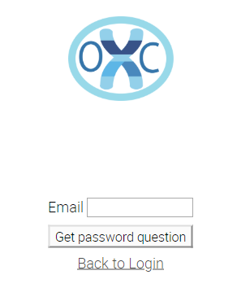
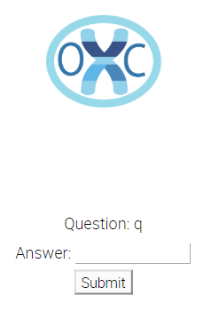
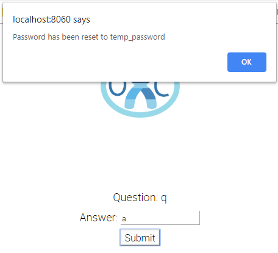

=================
Multiuser support
=================

OpenCRAVAT can be installed on a server to support multiple users each
with their own login and workspace for analysis results.
`open-cravat-multiuser <https://github.com/KarchinLab/open-cravat-multiuser>`__
is an add-on package to
`OpenCRAVAT <https://github.com/KarchinLab/open-cravat>`__ and adds the
support for multiple user accounts to OpenCRAVAT (from OpenCRAVAT
1.6.0). 

Note that the Multiuser package is only required for a shared
GUI experience. If command-line access is needed on a shared server,
OpenCRAVAT can be :doc:`installed via pip or conda <1.-Installation-Instructions>`
either system wide or on a per-user basis. However, if it is installed 
separately for each user, we recommend each user configure OpenCRAVAT 
to use a shared module directory.

``oc config md /shared/module/location``

Installation and requirements
=============================

Multiuser support is available through pip installation of the
``open-cravat-multiuser`` package after a normal installation of the
``open-cravat`` pip package.

open-cravat-multiuser requires
`OpenCRAVAT <https://github.com/KarchinLab/open-cravat>`__ >= 1.6.0,
aiohttp\_session, and cryptography pip packages, which will be installed
while open-cravat-multiuser is installed, if missing.

Install open-cravat-multiuser package with the following command.

``pip install open-cravat-multiuser``

Server Configuration
====================

The multiuser OpenCRAVAT should be configured to run on an appropriate
port for the server on which it is installed. If port 80 is available,
this will generally be the easiest to use. To set the port, first
identify where the ``cravat-system.yml`` configuration file is located.
Type:

``oc config system``

The first line of output will display the directory of OpenCRAVAT
configuration files. In this directory, edit the cravat-system.yml file
and set the gui\_port to the desired port. Example: ``gui_port: 80``.

Note: you may need to make sure that the firewall on your server allows
inbound http / https traffic on the specified port.

OpenCRAVAT can support HTTPS. To setup HTTPS, see
`here <https://github.com/KarchinLab/open-cravat/wiki/5.-GUI-usage#https-support>`__.
You can also setup https external to the OpenCRAVAT server in many ways.
For example, some reverse proxies perform https to http functions.

Starting Multiuser OpenCRAVAT Server
====================================

The multiuser version of OpenCRAVAT is started with the normal
``oc gui`` command with the ``--multiuser`` option. Since users will
generally run this on a remote server, this flag will not open a local
browser as ``oc gui`` normally does. Start the server with the command:

``oc gui --multiuser``

Admin Login
===========

The Multiuser OpenCRAVAT Server has a pre-configured administrator
login. This login is capable of installing annotators on the server from
the OpenCRAVAT store, changing server options, and reviewing general
jobs statistics. Initially, the username and the password for the admin
account are ``admin`` and ``admin``, respectively. We strongly recommend
changing the admin password after the initial login.

Admin tab
---------

Admin tab is only displayed for the admin user and shows job statistics
for all jobs run on the system. Choose the date range of interest in
``Date range`` and click ``Update``. Click ``Export`` to get the
statistics as a tab-separated file.

Admin - Jobs tab
----------------

``admin`` account cannot submit jobs and the job list on the Jobs tab of
the main page will show an additional column which will have the
username of each job in the list.

Admin System setting
--------------------

Settings icon (triple bar icon at the top right corner of the main page
of OpenCRAVAT web interface) will show only when logged in as ``admin``.
Details of the system setting is
`here <https://github.com/KarchinLab/open-cravat/wiki/5.-GUI-usage#system-setting>`__.
The important settings for an administrator to consider are the 'Maximum
number of concurrent jobs' and 'Maximum number of concurrent annotators
per job'. These should be tuned to the machine where multiuser
OpenCRAVAT is running. Concurrent annotators allow a single job to be
processed more quickly and concurrent jobs allow multiple user jobs to
be processed in parallel. If too many concurrent jobs and concurrent
annotators are allowed to run, the CPUs may be overwhelmed and
performance may degrade. It is also possible on this settings tab to
change the location of annotators and user jobs to directories that are
appropriate for the server.

Admin Store
-----------

In a multiuser server, only the admin will have permissions to install
modules from the OpenCRAVAT store. Select the Store tab when logged in
as admin to see the available modules and to install those that are
appropriate for your group.

User account operations
=======================

Connecting and Creating a user account
--------------------------------------

Users can connect to the multiuser OpenCRAVAT server just by entering
its URL. If it was configured to run on port 80, a user can just enter
the server name and connect to OpenCRAVAT. For example if multiuser
OpenCRAVAT was installed on a server with a host name of 'LabServer' on
port 80, the URL would be:

'http://LabServer/' or 'https://LabServer'

depending on whether https was configured. If it is running on a
non-standard port, then the port number would need to be added to the
URL. For example:

'http://LabServer:8060/'

Click ``Sign up`` to create your user account.

Enter your email, password, and password again. ``Question`` and
``Answer`` are for retrieving your password. Enter your own password
retrieval question and answer. Click ``Create account``. If there is any
error, the browser will notify. If your account has been successfully
created, a success notification will show and you will be redirected to
the main page of OpenCRAVAT web interface.

Login
-----

On the login page, enter your email and password and type ``Enter`` or
click ``Login``. If login is successful, you will be redirected to the
main page of OpenCRAVAT web interface.

Retrieving password
-------------------

If you forgot your password, on the login page, click
``Forgot password?``. Below page will show.

Enter your email and click ``Get password question``. You will be
directed to the next page of password retrieval, which will show the
password retrieval question you entered while creating your account.

Type the password retrieval answer you entered while creating your
account and click ``Submit``. If the answer is right, a popup will show
which states that your password has been reset to a temporary password
shown on the popup.

Click ``Ok`` on the popup and the browser will show the login page
again. Enter your email and the temporary password to login. You will be
redirected to the main page of OpenCRAVAT web interface.

Change password
---------------

At the top right corner of the main page of OpenCRAVAT web interface,
your email, change password icon, and logout icon are shown.

Click the change password icon to change your password. Enter your
current password in ``Old password``, and a new password in both
``New password`` and ``Retype new password``. Click ``Submit`` to finish
the password change.

Logout
------

Click the logout button to logout. You will be redirected to the login
page.

