====================================================
Getting Started with Open-Cravat on the Command Line
====================================================

.. contents::
   :depth: 3
..

Learning Objectives
===================

Working through this document, you will learn to:

-  **Install** the open-cravat software locally
-  **Search** for and **Install** available annotators
-  **Explain** compatible variant formats
-  **Annotate** variant files using the CLI tools
-  **Filter** annotated results for visualization
-  **Visualize** and **Summarize** Results in Open-Cravat

The Basic Open-Cravat Workflow
------------------------------

In the diagram below, we’ll see the basic Open-Cravat workflow on the
command-line. You can click on the boxes in the diagram to jump to that
section.

.. mermaid::

   flowchart TD
      L[Prepare for Installing] --> A
      click L "#preparing-and-installing-open-cravat"
      A[Installation] --> G[Install Annotators]
      click A "#installing-opencravat"
      click G "#installing-annotators"
      G --> B[Convert to Input File Format]
      click B "#understanding-the-input-file-format"
      B -->|Variant File Input| C[Map Variants and Annotate]
      click C "#annotating-our-example"
      C -->|Results|D[Start Results Viewer]
      click D "#starting-the-results-viewer"
      D -->|Results| E[Filter Results]
      click E "#examining-our-results-file-and-filtering"
      E -->|Results| F[Visualizing Filtered Results]
      click F "#visualizing-our-filtered-results"

Preparing and Installing Open Cravat
------------------------------------

.. youtube:: TxY7-c01t28

Make sure you know where your Python is installed using the ``which``
command. In my example, I have python 3.11 installed via Homebrew, which
is the python I want to use. In my case, since I’m on MacOS, I know that
I run python programs using ``python3`` rather than ``python``.

.. code:: bash

   which python3

::

   tedladeras@teds-MacBook-Pro ~ % which python3
   /opt/homebrew/bin/python3

Also, check whether you have ``pip`` or ``pip3`` installed, and whether
it has a similar location to your ``python3``.

.. code:: bash

   which pip3

::

   tedladeras@teds-MacBook-Pro ~ % which pip3
   /opt/homebrew/bin/pip3

Using a Virtual Environment
~~~~~~~~~~~~~~~~~~~~~~~~~~~

You should create a virtual environment so that your OpenCRAVAT
installation is isolated from other installations. We’ll use ``venv``,
which installed in the default Python distribution.

We’ll make a separate virtual environment using the ``venv`` command.
Here we’re creating a virtual environment called ``oc``:

.. code:: bash

   python3 -m venv oc

This creates a folder called ``oc`` in our current directory. This is
where all of our separate Python packages will live. Then we’ll activate
the virtual environment using ``source``:

.. code:: bash

   source oc/bin/activate

You can double check whether the environment is activated by using
``which python3`` again. It should poiint to the ``bin`` folder within
your virtual environment folder.. Note that our prompt also has an
``(oc)`` in front.

.. code:: bash

   which python3

::

   (oc) tedladeras@teds-MacBook-Pro ~ % which python3
   /Users/tedladeras/oc/bin/python3

Installing OpenCRAVAT
~~~~~~~~~~~~~~~~~~~~~

Now we can install Open Cravat using ``pip``/``pip3``.

.. code:: bash

   pip3 install open-cravat

::

   tedladeras@teds-MacBook-Pro local % pip3 install open-cravat
   Collecting open-cravat
     Downloading open-cravat-2.4.2.tar.gz (3.1 MB)
        ━━━━━━━━━━━━━━━━━━━━━━━━━━━━━━━━━━━━━━━━ 3.1/3.1 MB 40.4 MB/s eta 0:00:00
     Preparing metadata (setup.py) ... done
   Collecting pyyaml (from open-cravat)
     Downloading PyYAML-6.0.1-cp311-cp311-macosx_11_0_arm64.whl.metadata (2.1 kB)
   Collecting requests (from open-cravat)
     Downloading requests-2.31.0-py3-none-any.whl.metadata (4.6 kB)
   Collecting requests-toolbelt (from open-cravat)
     Downloading requests_toolbelt-1.0.0-py2.py3-none-any.whl (54 kB)

Confirm that Open Cravat is installed:

.. code:: bash

   oc --help

::

   tedladeras@teds-MacBook-Pro ~ % oc --help
   usage: oc [-h] {run,report,gui,module,config,new,store,util,version,feedback} ...

   Open-CRAVAT genomic variant interpreter. https://github.com/KarchinLab/open-cravat

   options:
     -h, --help            show this help message and exit

   Commands:
     {run,report,gui,module,config,new,store,util,version,feedback}
       run                 Run a job
       report              Generate a report from a job
       gui                 Start the GUI
       module              Change installed modules
       config              View and change configuration settings
       new                 Create new modules
       store               Publish modules to the store
       util                Utilities
       version             Show version
       feedback            Send feedback to the developers

All of our interactions with OpenCRAVAT will be prefaced by ``oc``. For
example, we can launch the OpenCRAVAT GUI as a webserver on our machine
using

.. code:: bash

   oc gui

Now you’re ready to start installing annotators.

Installing via Bioconda
-----------------------

.. youtube:: 6eeWWDvPHOM

If you prefer to install via ``conda``/``mamba``, here are directions
for you. You will want to install ``mamba`` via ``miniforge``: download
the installation scripts here.

When ``mamba`` has been installed, you’ll need to create a conda
environment and install open-cravat via a single command:

.. code:: bash

   mamba create --name oc open-cravat

This will create an environment called ``oc``

When you’re ready to use Open-Cravat, you can activate this ``oc``
environment:

.. code:: bash

   mamba activate oc

Confirm that you can see the ``oc`` executable with ``which``. It should
be where you installed miniforge:

.. code:: bash

   which oc

::

   /Users/tedladeras/miniforge3/envs/oc/bin/oc

Now you can use Open-Cravat as below and install annotators.

Installing annotators
---------------------

.. youtube:: 9NQIG6pW6lo

The first thing we’ll need to install are some core bits of Open Cravat,
called ``install-base``. We’ll do this with the command ``oc module``:

.. code:: bash

   oc module install-base

::

   tedladeras@teds-MacBook-Pro local % oc module install-base
   Installing: casecontrol:1.2.0, cravat-converter:1.1.2, excelreporter:2.1.1, go:2022.11.01, hg38:1.11.0, hg38wgs:1.0.0, oldcravat-converter:1.1.2, tagsampler:1.1.6, textreporter:2.1.0, varmeta:1.0.0, vcf-converter:2.2.1, vcfinfo:2.0.0, wgbase:1.1.3, wgcasecontrols:1.0.1, wgcasecontrolsummary:1.0.1, wgcircossummary:2.2.0, wgcodingvsnoncodingsummary:2.0.0, wggo:1.2.0, wggosummary:2.4.0, wghg19:1.0.3, wglollipop:2.2.1, wgncrna:1.1.0, wgndex:1.1.0, wgnote:3.0.0, wgrankscore:1.1.0, wgsosamplesummary:2.2.0, wgsosummary:1.5.0, wgvcfinfo:1.0.3
   [2024:01:31 14:17:48] Starting to install casecontrol:1.2.0...
   [2024:01:31 14:17:48] Downloading code archive of casecontrol:1.2.0...
   [**************************************************] 21.4 kB / 21.4 kB (100%)  
   [2024:01:31 14:17:49] Extracting code archive of casecontrol:1.2.0...
   [2024:01:31 14:17:49] Verifying code integrity of casecontrol:1.2.0...
   [2024:01:31 14:17:49] Finished installation of casecontrol:1.2.0
   [2024:01:31 14:17:49] Starting to install cravat-converter:1.1.2...
   [2024:01:31 14:17:49] Downloading code archive of cravat-converter:1.1.2...

   ....[intermediate output skipped]

   [**************************************************] 670 B / 670 B (100%)  
   [2024:01:31 14:19:57] Extracting code archive of wgvcfinfo:1.0.3...
   [2024:01:31 14:19:57] Verifying code integrity of wgvcfinfo:1.0.3...
   [2024:01:31 14:19:57] Finished installation of wgvcfinfo:1.0.3

Let’s list the available annotators. This is a very large list of
annotators. This is just the first few entries.

.. code:: bash

   tedladeras@teds-MacBook-Pro local % oc module  ls -a -t annotator

::

   Name                               Title                                                 Type       Installed  Store ver   Store data ver     Local ver   Local data ver  Size      
   abraom                             ABRaOM                                                annotator             1.0.0                                                      113.6 MB  
   alfa                               ALFA: Allele Frequency Aggregator                     annotator             1.0.0       2020.02.29                                     19.8 GB   
   alfa_african                       ALFA: Allele Frequency Aggregator African             annotator             1.0.0       2020.02.29                                     23.2 GB   
   alfa_asian                         ALFA: Allele Frequency Aggregator Asian               annotator             1.0.0       2020.02.29                                     24.1 GB   
   alfa_european                      ALFA: Allele Frequency Aggregator European            annotator             1.0.0       2020.02.29                                     19.8 GB   
   alfa_latin_american                ALFA: Allele Frequency Aggregator Latin American      annotator             1.0.0       2020.02.29                                     20.3 GB   
   alfa_other                         ALFA: Allele Frequency Aggregator Others      

   ....

We’re actually looking for ClinVar, which is a list of clinically
relevant annotations. Note that all of the annotators are in lower snake
case (such as ``alfa_asian``). So we can add ``clinvar`` in with our
query.

.. code:: bash

   oc module ls -a clinvar -t annotator 

::

   tedladeras@teds-MacBook-Pro local % oc module ls -a clinvar -t annotator 
   Name     Title    Type       Installed  Store ver   Store data ver  Local ver  Local data ver  Size      
   clinvar  ClinVar  annotator             2023.02.01  2023.02.01.1                               381.8 MB  

Ok, now we know our annotator exists, and we can install it with the
``oc module install`` command:

.. code:: bash

   oc module install clinvar

We’ll need to confirm ``y`` to proceed:

::

   tedladeras@teds-MacBook-Pro local % oc module install clinvar
   Installing: clinvar:2023.02.01, wgclinvar:1.1.1
   Proceed? ([y]/n) > y

Then the installation will proceed:

::

   [2024:01:31 14:25:08] Starting to install clinvar:2023.02.01...
   [2024:01:31 14:25:08] Downloading code archive of clinvar:2023.02.01...
   [**************************************************] 290.9 kB / 290.9 kB (100%)  
   [2024:01:31 14:25:09] Extracting code archive of clinvar:2023.02.01...
   [2024:01:31 14:25:09] Verifying code integrity of clinvar:2023.02.01...
   [2024:01:31 14:25:09] Downloading data of clinvar:2023.02.01...
   [**************************************************] 49.0 MB / 49.0 MB (100%)  
   [2024:01:31 14:25:15] Extracting data of clinvar:2023.02.01...
   [2024:01:31 14:25:15] Verifying data integrity of clinvar:2023.02.01...
   [2024:01:31 14:25:16] Finished installation of clinvar:2023.02.01
   [2024:01:31 14:25:16] Starting to install wgclinvar:1.1.1...
   [2024:01:31 14:25:16] Downloading code archive of wgclinvar:1.1.1...
   [**************************************************] 36.8 kB / 36.8 kB (100%)  
   [2024:01:31 14:25:17] Extracting code archive of wgclinvar:1.1.1...
   [2024:01:31 14:25:17] Verifying code integrity of wgclinvar:1.1.1...
   [2024:01:31 14:25:17] Finished installation of wgclinvar:1.1.1

Understanding the Input File Format
-----------------------------------

We can generate an example file using ``oc new example-input``. Note the
period at the end, which means that we will generate the file in the
current directory:

.. code:: bash

   oc new example-input .

Let’s confirm that we created this example:

.. code:: bash

   ls -l example*

::

   tedladeras@teds-MacBook-Pro ~ % ls -l example*
   -rw-r--r--  1 tedladeras  staff    9036 Jan 31 14:27 example_input

Note the created file has an underscore (``_``) rather than a dash
(``-``). Let’s take a look at the ``example_input`` file that we
created:

.. code:: bash

   cat example_input | head

::

   chr1    69091   +   A   C   s0
   chr1    69091   +   ATG C   s0
   chr6    31039077    +   C   G   s0
   chr1    27612918    +   G   a   s1
   chr1    27612918    +   G   A   s0
   chrM    235 +   A   G   clinvar
   chrM    3308    +   T   C   omim
   chr8    54626835    +   A   T   s0
   chr4    1804372 +   A   G   s1
   chr4    1804372 +   AT  GC  s1
   chr4    1804372 +   A   T   s1

Annotating our example
----------------------

.. youtube:: FzvuDELhnd4

Now we have our example, we can run Open Cravat. This will annotate our
``example_input`` file with all available annotators.

.. code:: bash

   oc run ./example_input -l hg38

::

   tedladeras@teds-MacBook-Pro ~ % oc run ./example_input -l hg38
   Input file(s): /Users/tedladeras/example_input
   Genome assembly: hg38
   Running converter...
       Converter (converter)           finished in 0.124s
   Running gene mapper...                  finished in 2.668s
   Running annotators...
       annotator(s) finished in 1.466s
   Running aggregator...
       Variants                        finished in 0.010s
       Genes                           finished in 0.003s
       Samples                         finished in 0.022s
       Tags                            finished in 0.025s
   Indexing
       variant base__coding    finished in 0.000s
       variant base__chrom finished in 0.000s
       variant base__so    finished in 0.000s
   Running postaggregators...
       Tag Sampler (tagsampler)        finished in 0.008s
   Finished normally. Runtime: 4.539s

Starting the Results Viewer
---------------------------

.. youtube:: uSOQjuawaOU

We saw that one of the files generated was an ``.sqlite`` file. These
are our results, which we can visualize using ``oc gui``, which will
launch the a web server so we can examine our results using the GUI:

.. code:: bash

   oc gui example_input.sqlite

::

   tedladeras@teds-MacBook-Pro ~ % oc gui example_input.sqlite

      ____                   __________  ___ _    _____  ______
     / __ \____  ___  ____  / ____/ __ \/   | |  / /   |/_  __/
    / / / / __ \/ _ \/ __ \/ /   / /_/ / /| | | / / /| | / /   
   / /_/ / /_/ /  __/ / / / /___/ _, _/ ___ | |/ / ___ |/ /    
   \____/ .___/\___/_/ /_/\____/_/ |_/_/  |_|___/_/  |_/_/     
       /_/                                                     

   OpenCRAVAT is served at localhost:8080
   (To quit: Press Ctrl-C or Ctrl-Break if run on a Terminal or Windows, or click "Cancel" and then "Quit" if run through OpenCRAVAT app on Mac OS)
   (Getting result of [example_input.sqlite]:[variant]...)
   Done getting result of [example_input.sqlite][variant] in 0.029s
   (Getting result of [example_input.sqlite]:[gene]...)
   Done getting result of [example_input.sqlite][gene] in 0.021s

A window should open in your web browser. If not, enter
https://localhost:8080 to view the file.

|image2|

Examining our Results File and Filtering
----------------------------------------

.. youtube:: Nqm3iDN0Vx8

Now we take a look at our results in the web interface. Under the list
of jobs, we can see our job. Let’s select ``Open Result Viewer`` under
the **Status** tab:

|image3|

Keep in mind that the web interface is limited to visualizing 100,000
variants, so if you have a larger result file, you’ll need to filter the
results down. So let’s take a look at how to filter our variants down.

We can filter variants by selecting the Filter tab in the Results
viewer:

|image4|

Under “Variant Properties” we can limit our list of variants to those
that have ClinVar annotations. Let’s build a filter using the Query
Builder, which will allow us to impose multiple criteria as a filter.

|image5|

We’ll add a rule (a logical condition) to our filter using the ``+``
button:

|image6|

Now we’ll add a rule and select those that have ``ClinVar`` annotations.
To do this, we’ll first select a) ``ClinVar`` on the left, the b)
``Clinical Significance`` column, and c) ``has data``:

|image7| Now we can apply this rule we’ve built by clicking on the
**Apply Filter** button on the bottom right of the Query Builder:

|image8| How many variants are left after the filtering?

.. container::

      **Calculating the Effect of Filters**

      If you have multiple filters, you can actually precalculate the
      numbers of variants after filtering by using the icon below.

      |image9|

      This can be helpful to check if your filters are too strict (that
      is, they won’t return anything).

      Just note that the filter is not actually applied to the data
      until you hit the **Apply Filter** Button.

Visualizing Our Filtered Results
--------------------------------

.. youtube:: AFcOMdrW24s

Now that we’ve filtered, let’s go back to the Summary Tab:

|image10| In the Summary tab, we can see information about the annotated
variants, such as from the sequence ontology. We can get the counts
within a sequence ontology category by mousing over that category in our
plot:

|image11| These visualizations can be moved around and pinned. Using the
camera icon, you can also save these visualizations.

Let’s move over to the **Variant** tab and look for pathogenic variants.
First, we’ll click over to the **Variant** tab:

|image12| Scrolling to the right, we can see there is a column for the
ClinVar annotations. Notice the **+** on the top right. We’ll click that
to expand the ClinVar annotations:

|image13| 

In the **Clinical Significance** column, we can see that we
can filter. Let’s select those variants that have **pathogenic**
significance. Clicking into the search box underneath this column, we
can select **pathogenic**:

|image14|

How many variants are pathogenic?

The last thing we might want to do is to export our results. We can use
the export button at the bottom of the table:

|image15|

When you click that, you will have the option to export the variant
level results as a tab seperated value (TSV) file. Note that this result
table will have filters applied to it as well.

.. container::

      **Multiple Rules**

      Note that we could have limited our search to pathogenic variants
      by adding another filter rule like we did above in the filtering
      step. We’re showing this way in case you didn’t know the available
      categories within the ``Clinical Significance`` column.

Deactivating Your Environment
-----------------------------

When you’re done using Open-Cravat and it’s installed by an environment,
make sure to deactivate:

For the ``python/venv`` installation:

.. code:: bash

   deactivate

For the ``mamba/conda`` installation:

.. code:: bash

   mamba deactivate

What You Learned
----------------

We learned the following in this section:

-  **Prepare** your system for installing OpenCRAVAT
-  **Install** the OpenCRAVAT software locally using ``pip``
-  **Search** for and **Install** available annotators
-  **Explain** compatible variant formats
-  **Annotate** variant files using the CLI tools
-  **Visualize** and **Summarize** Results in OpenCRAVAT

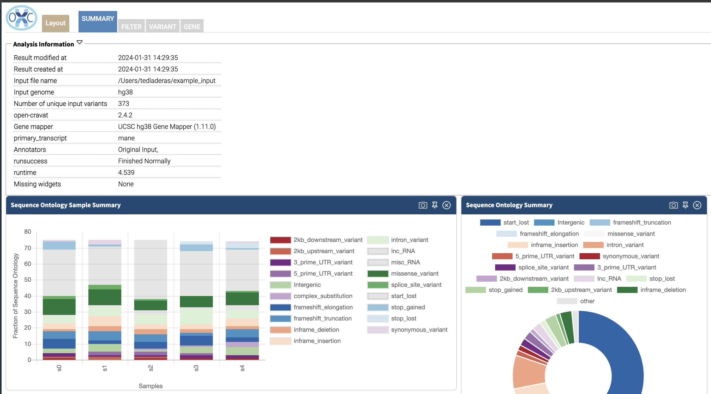
.. |image3| image:: images/oc-filter-job.png
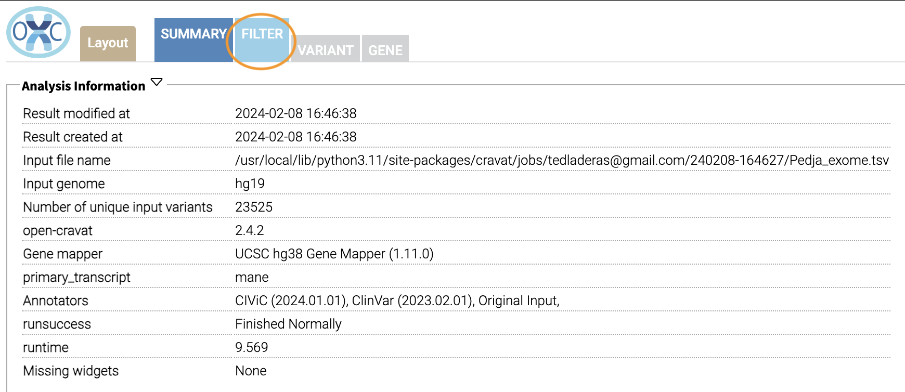
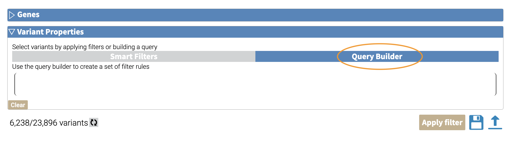
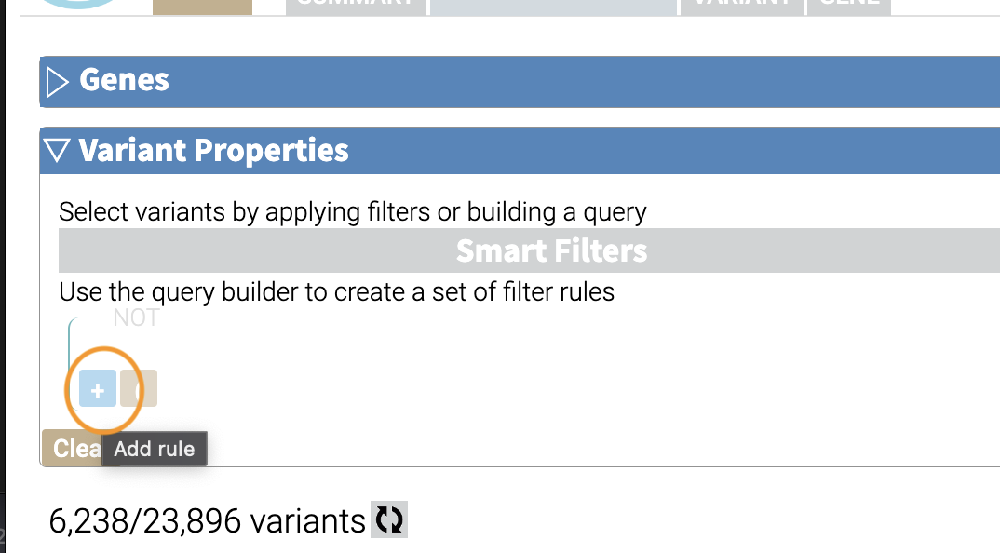
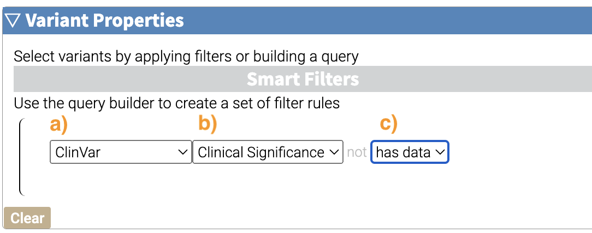
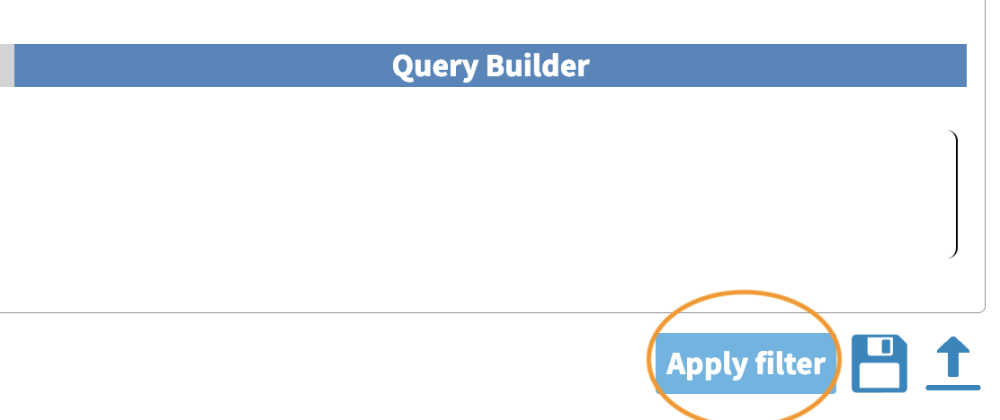
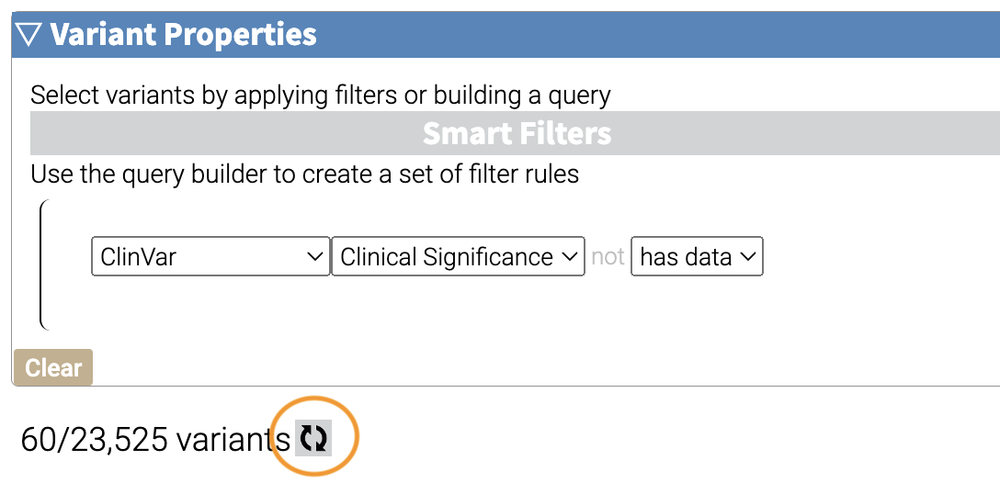
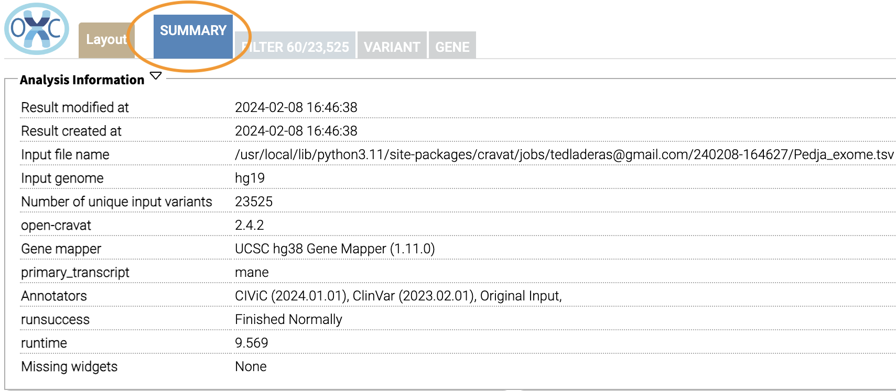
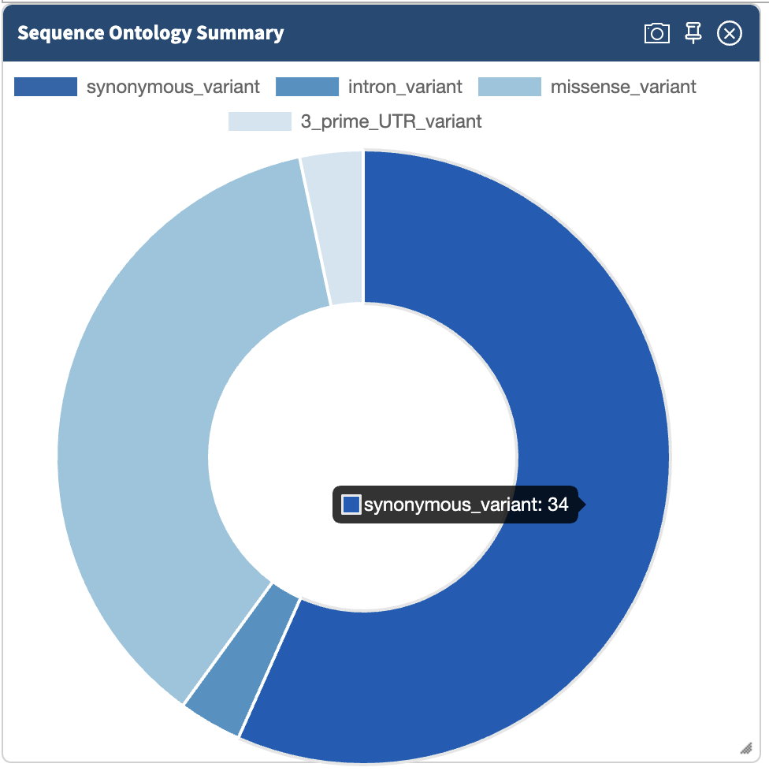
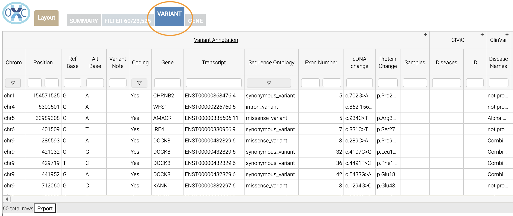
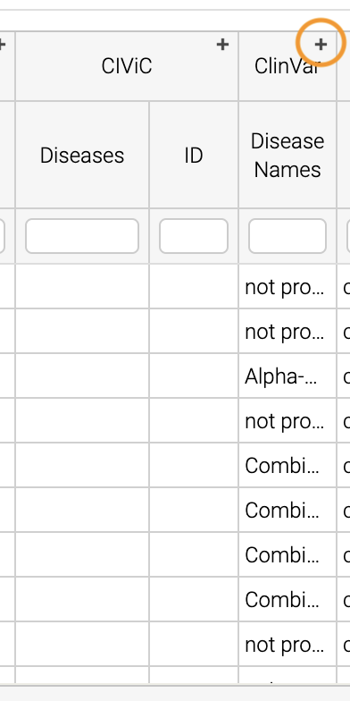
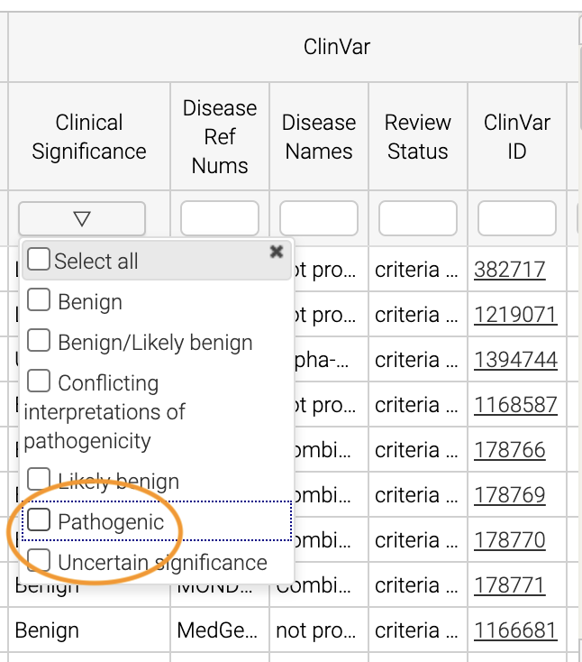
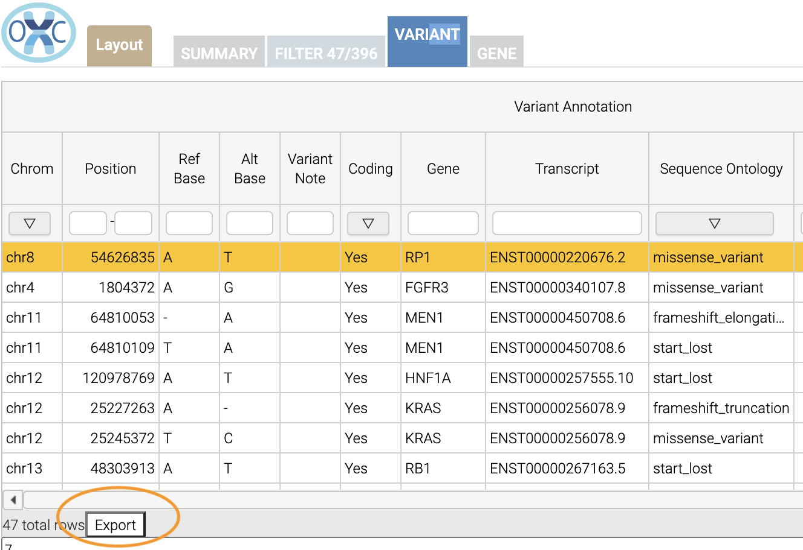
