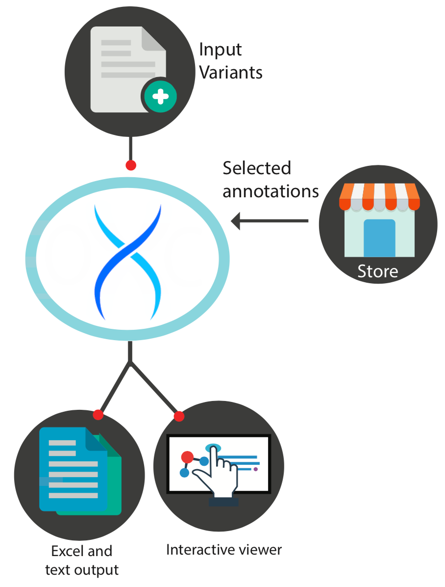
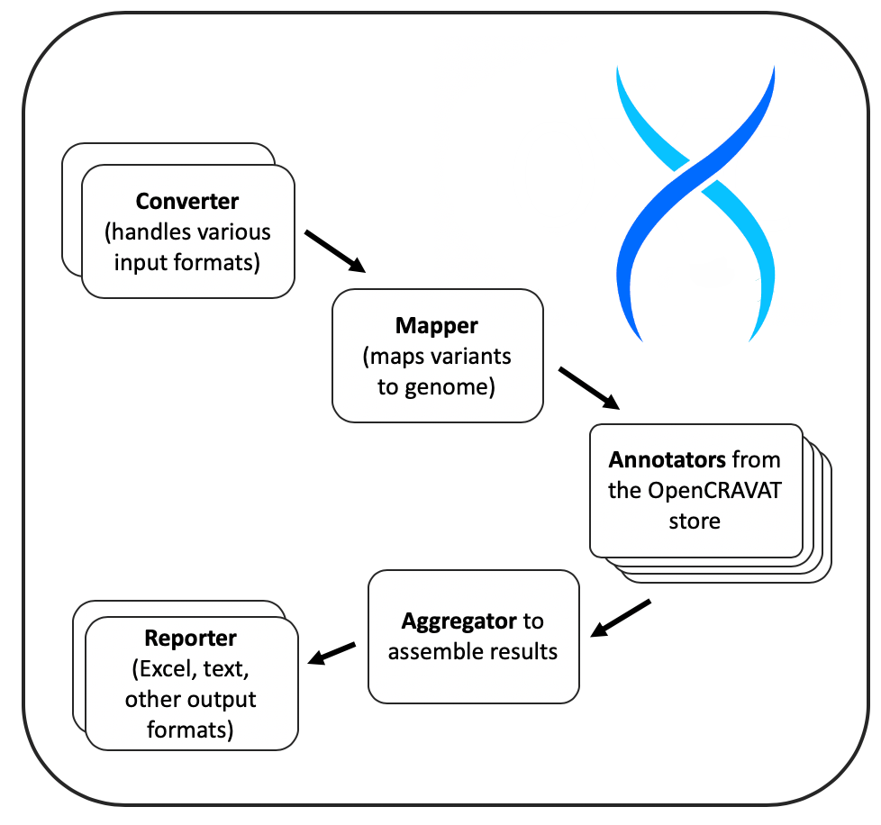

.. open-cravat documentation master file, created by
   sphinx-quickstart on Wed Dec 23 11:46:57 2020.
   You can adapt this file completely to your liking, but it should at least
   contain the root `toctree` directive.

=======================================
Welcome to open-cravat's documentation!
=======================================

OpenCRAVAT
==========

.. toctree::
  :hidden:
  :caption: Getting started

  Home.rst
  getting_started_web.rst
  getting_started_cli.rst
  1.-Installation-Instructions.rst
  2.-Command-line-usage.rst
  3.-Viewing-Results.rst
  5.-GUI-usage.rst
  Uninstallation.rst
  Update-Instructions.rst

.. toctree::
  :hidden:
  :caption: Additional Tools

  OpenCRAVAT-Variant-Report.rst
  VCFAnno.rst

.. toctree::
  :hidden:
  :caption: Advanced

  Filter-Tutorial.rst
  Case-Control.rst
  Cloud.rst
  AWS-OpenData.rst
  API.rst
  Multiuser-support.rst
  Filter-And-Merge-SQLite.rst
  Package.rst
  Release-Notes.rst
  Metrics.rst

.. toctree::
  :hidden:
  :caption: For contributors 

  Developer-onboarding.rst
  File-Formats.rst
  Annotator-Reference.rst
  Annotator-Tutorial.rst
  Widget-Tutorial.rst
  Reporter.rst
  Publish-an-Annotator.rst

`OpenCRAVAT <https://opencravat.org/>`__ is a python package that
performs genomic variant interpretation including variant impact,
annotation, and scoring. There is a web-based version of OpenCRAVAT
(https://run.opencravat.org) but it can also be installed locally and is
easy to integrate into bioinformatics pipelines. OpenCRAVAT has a
modular architecture with a wide variety of analysis modules that can be
selected and installed/run based on the needs of a given study. The
modules are made available via the CRAVAT Store and are developed both
by the CRAVAT team and the broader variant analysis community.
OpenCRAVAT is a product of the `Karchin Lab <http://karchinlab.org/>`__
at `Johns Hopkins University <https://www.jhu.edu/>`__ with funding
provided by the National Cancer Institute's
`ITCR <https://itcr.cancer.gov/>`__ program.

Overview
--------

OpenCRAVAT is a modular python package that is available in the pip
`PyPI repository <https://pypi.org/project/open-cravat/>`__. It takes a
file of genomic variants as input. The most common input format is a VCF
file but other formats are supported including dbSNP identifiers, 23&Me
and Ancestry.com file formats.

The analysis performed by OpenCRAVAT depends upon user-selected
annotation and visualization options, available for download from the
free OpenCRAVAT Store. In addition to the interactive user interface,
OpenCRAVAT provides several output formats including text reports, Excel
spreadsheets, and a SQLite database of results used by cravat_view.

OpenCRAVAT Processing
---------------------

When the pipeline program is run, it will execute a series of modules
required for variant analysis. First, the appropriate converter will be
run to parse the input variant file. Next, a mapper module will
determine the transcripts and associated genes affected by each variant
including protein impact. Then OpenCRAVAT runs all of the
requested/installed annotation modules and after all annotation is
complete, an aggregator program collects and collates the results into a
SQLite database. Finally, reporter modules are run to produce the
requested format of results.

Available Modules
-----------------

As of 5/22/2025, OpenCRAVAT has the following annotators available, with
more on the way.

-  *Gene-level annotators:* BioGRID, Cancer Gene Census, Cancer Gene
   Landscape, Cancer Genome Interpreter, Constrained Coding Regions,
   Clinical Genomic Database, CIViC Gene, ClinGen Gene, COSMIC Gene, 
   Essential Genes, ExAC Gene and CNV, Gene Ontology, GHIS, gnomAD, 
   GTEx, HaploReg, HGDP, Human Phenotype Ontology, IntAct, InterPro, 
   LoFtool, LINSIGHT, MuPIT, Mutpanning, NCBI Gene, NDEx, P(rec), 
   p(HI), PangaloDB, Promoter IR, PubMed, RVIS, TARGET, UniProt,
   VEST
-  *Variant-level annotators:* All of Us, ALoFT, AlphaMissense,
   Arrhythmia Channelopathy Variants, BayesDel, BRCA1 Saturation
   Genome Editing Scores, CADD, CADD Exome, Cancer Hotspots,
   CardioBoost, CEDAR, CIViC, ClinGen Allele Registry, ClinPred,
   ClinVar, ClinVar ACMG, ClinVar, COSMIC, CScape, CScape Coding,
   Cardiovascular Disease Knowledge Portal, DANN, DANN Coding,
   dbCID: Database of Cancer Driver InDels, dbscSNV, dbSNP, dbSNP Common,
   Denovo-DB, DGIdb: The Drug Interaction Database, DITTO, ESM1b,
   EVE, FATHMM, FATHMM MKL, FATHMM XF, FATHMM XF Coding, fitCons,
   Flanking Sequence, FunSeq2, GERP++, Geuvadis eQTLs, gMVP, GRASP,
   GTEx eQTLs, GWAS Catalog, HaploReg African, HaploReg American,
   HaploReg Asian, HaploReg European, hg19 coordinates, LINSIGHT,
   LitVar Full, Likelihood Ratio Test, MetaLR, MetaRNN, MetaSVM,
   MISTIC (MISsense deleTeriousness predICtor), MITOMAP, MuPIT,
   Mutation Assessor, MutationTaster, MutPred, MutPred-Indel,
   NDEx Congenital Heart Disease, NDEx SIGNOR, OMIM, PharmGKB,
   Phast Cons, PhD-SNPg, PhyloP, PolyPhen-2, PrimateAI, Regeneron,
   REVEL, Segway, SIFT, SiPhy, SpliceAI, Uniprot Domain, VARITY_R, VEST4
-  *Converters (input formats):* TSV, VCF, HGVS, dbSNP, ClinGen Allele Registry,
   Ancestry.com, 23andMe, FamilyTreeDNA 
-  *Reporters (output formats):* Text format, Excel, TSV, CSV, Annotated
   VCF, Pandas, RData

System Capabilities
-------------------

In most cases, OpenCRAVAT can process approximately **1 million variants
per hour**. This estimate assumes that 2/3 of the input variants are in
coding regions, approximately ten annotation modules, and the system is
running on an at least 4 year old laptop with a solid state drive.
Runtimes depend heavily on disk speed. A mechanical hard drive will
perform about 1/3 to 1/4 as well as an SSD. Most modern processors are
equivalent since the disk will bottleneck annotation speed before the
processor. However, processors with fewer than four cores may see
reduced runtimes. Memory size is not typically a limitation.

Getting Started
---------------

For a simple introduction to running OpenCRAVAT, please consult the
`Quickstart guide <./quickstart>`__.

How to cite
-----------

Pagel KA et al. Integrated Informatics Analysis of Cancer-Related
Variants. JCO Clinical Cancer Informatics 2020 4, 310-317.

OpenCRAVAT users are encouraged to cite individual annotations used in
their study analysis.

Indices and tables
==================

* :ref:`genindex`
* :ref:`modindex`
* :ref:`search`
