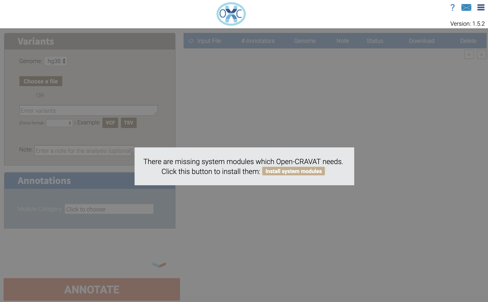
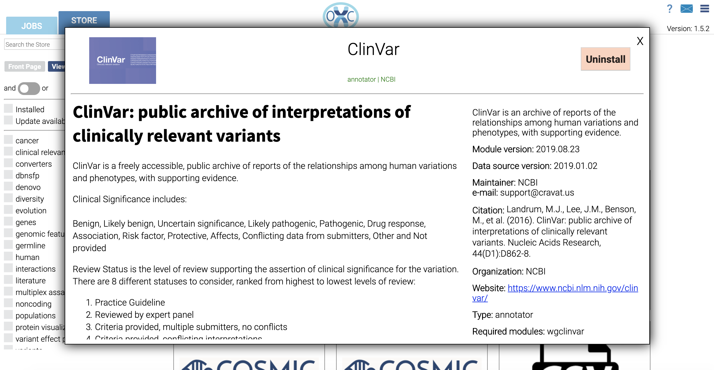

.. role:: raw-latex(raw)
   :format: latex
..

==========
Quickstart
==========

OpenCRAVAT consists of three components: python, the ``open-cravat``
python package, and a base set of reference data. For advanced users,
command line instructions are available in the `Command line
quickstart <quickstart-command-line.html>`__.

Installing with Windows or Mac OS Installer
-------------------------------------------

**Windows users**: `Windows
installer <https://karchinlab.org/opencravat/installers/open-cravat-2.2.7.exe>`__

Windows Defender may indicate that it prevented an unknown application
from running. If so, click the 'More' link on the message and then
select 'Run Anyway'. An "OpenCRAVAT" icon will be created on the Desktop
and the Start Menu. Continue this Quickstart from "Install base
modules".

**Mac OS users**: `Mac OS
installer <https://karchinlab.org/opencravat/installers/OpenCRAVAT.2.2.7.pkg>`__

Right-click the downloaded file and select "Open". Your Mac may ask you
to confirm stating that the file was not downloaded from the App Store.
Click "Open" button. Just double-clicking the installer may not enable
this "Open" option. Continue this Quickstart from "Install base
modules".

Installing Python Package manually
----------------------------------

Alternatively, if Python version 3.6 or newer is installed, the
OpenCRAVAT Python package can be installed using pip following the
instructions below.

Install python
~~~~~~~~~~~~~~

Follow the instructions on `python.org <http://www.python.org>`__ to
install Python version 3.6 or newer. Pip, python's package manager, must
be included in the installation.

**For Mac OS:** We recommend installing Python 3 using the installation
file provided at `python.org <http://www.python.org>`__. After
installing Python 3, a new terminal must be opened to execute the
following commands.

**For Ubuntu:** pip3 provided by apt does not install executables
properly. We recommend the following steps before proceeding.
``sudo apt remove python-pip`` if pip3 has already been installed with
apt. Then ``wget https://bootstrap.pypa.io/get-pip.py`` and
``sudo python3 get-pip.py``.

Install open-cravat package
~~~~~~~~~~~~~~~~~~~~~~~~~~~

With Python 3.6 or newer installed, run the following command to install
the OpenCRAVAT pip package.

::

    pip install open-cravat

Depending on your python configuration, the base command for pip may be
be ``pip3`` instead of ``pip``. ``sudo`` should be avoided in installing
OpenCRAVAT.

If you use Windows and your Python 3 is installed inside of a
system-level folder such as "C::raw-latex:`\Program `Files", you may
have a problem with running OpenCRAVAT without admin privilege. In this
case, we recommend installing Python 3 outside of system-level folders
and then installing OpenCRAVAT.

Install base modules
--------------------

Now that the OpenCRAVAT python package is installed, you must install
the base modules. This can be done either through OpenCRAVAT's web
interface, or though the command line interface. This quickstart will
continue with instructions using the web interface. Command line
instructions are available in the `command line quickstart
page <quickstart-command-line>`__.

The web interface is started by running a local web server, then
connecting it using a browser. Both these actions can be taken by
running the following command in any command shell.

.. code:: shell

    oc gui

This will start a python server in the shell it was run in. It will also
open your default web browser to the main page of the web interface.
Closing the command line shell will shutdown the server.

The initial page of the web interface looks like this.

Click the **Install system modules** button to download the required
system files. One of the modules, UCSC hg38 Gene Mapper, requires
approximately 2 Gb of reference data, and may not download quickly.
Download progress will appear in the bottom of the screen. Leaving the
page will not affect the downloads.

Install an annotator
--------------------

Once the base install is finished, navigate to the store tab. It should
now show available annotators.

We will install the ClinVar module, as it is relatively small. Clicking
on the ClinVar panel will open up a detail panel for that module.

The "Install" button on the top right will install ClinVar. After the
installation is finished, navigate back to the Jobs tab to submit a test
job.

Submitting a job
----------------

.. figure:: figures/Submission_screen2.png
   :alt: 

To submit a test job, click on either the **VCF** or **tsv** buttons
underneath the text box in the **Variants** panel. This will load in a
few example variants. Next, click the **Annotate** button at the bottom
to submit the job.

After submission, a new row should appear in the jobs table on the
right. The status column should say "Submitted". As the job runs, the
status column will update to reflect the job status.

When a job is finished, launch the web viewer in a new tab by clicking
the **Open Result Viewer** button. This will open up the results viewer
in a new tab. Instructions for using the results viewer are available
`here <./3.-Results#interactive-viewer>`__

Stopping the web interface
--------------------------

In the terminal that opened with OpenCRAVAT, press Cancel and then Quit.

Multiuser support
-----------------

OpenCRAVAT's web interface can have multiple user accounts by installing
`open-cravat-multiuser <https://github.com/KarchinLab/open-cravat-multiuse>`__
package (from OpenCRAVAT 1.6.0). See `this
page <https://github.com/KarchinLab/open-cravat/wiki/Multiuser-support>`__
for the details of using multiple user accounts with OpenCRAVAT.
